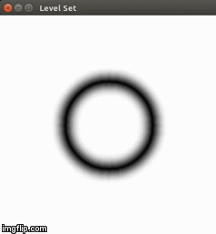
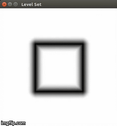

> *Don't forget to add [Mathjax](https://www.mathjax.org/) plugin for GitHub*
# Level Set
> Level set method is widely used in robustly and correctly tracking interfaces under complex motions. If the level set function is at the same time a signed distance function, then a lot of simplicationscan be made. In this project, I implement the crossing-time method which is described in the book *Level Set Methodsand Dynamic Implicit Surfaces* by Stanley Osher and Ronald Fedkiw. The crossing-time method is one of the basic methods that can convert the level set field to a signed distance field, that is: $|\nabla\phi| = 1 $     
> - The result of an originally circle interface:  
    
> - The result of an originally square interface:  
   
